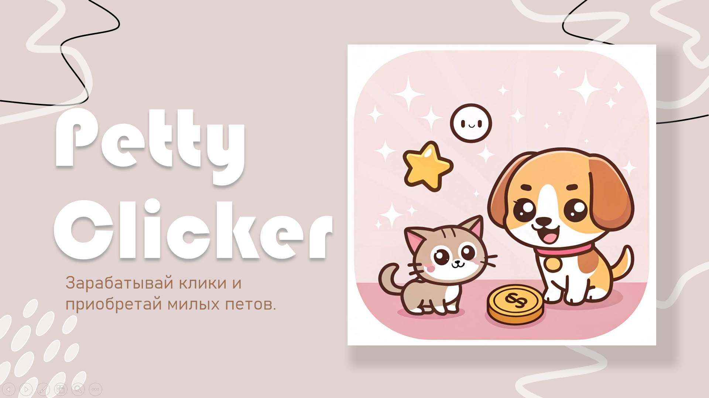
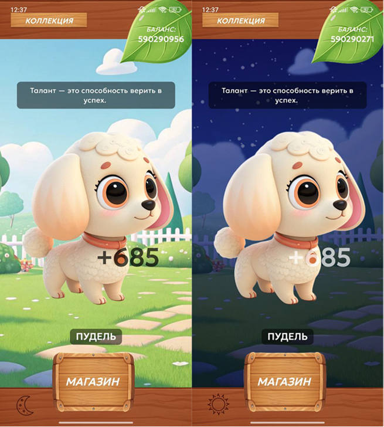
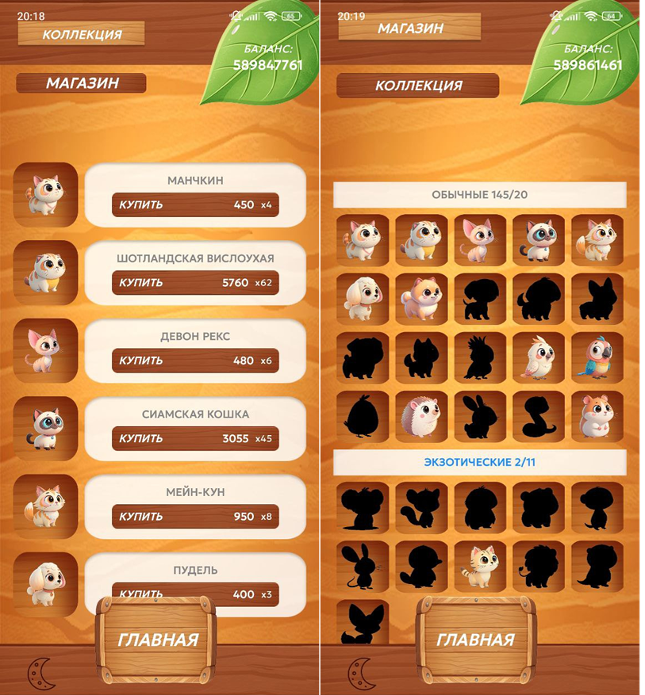

🐾 Petty Clicker
Современное Android-приложение в жанре idle clicker с системой коллекционирования питомцев и автокликером.

## 📱 Описание
Petty Clicker — это Android-игра, в которой пользователь зарабатывает очки, кликая по экрану, и тратит их на покупку питомцев разной редкости. Система автокликера, бонусов и кастомизации делает игру увлекательной и динамичной.
Приложение построено на современной архитектуре MVVM с использованием Jetpack Compose, Room, Hilt и StateFlow.

## 🌟 Ключевые особенности:
Минималистичный UI с поддержкой тёмной темы
Коллекция питомцев: обычные, экзотические, фантастические и легендарные
Автокликер, активируемый легендарными питомцами
Анимации кликов и визуальные бонусы
Персонализация питомцев (имя, тип, отображение)

 

## 🛠 Используемые технологии
- UX & UI
- Jetpack Compose — UI на декларативной основе
- Material Design 3 — современные стили и компоненты
- Navigation Compose — управление навигацией
- StateFlow — реактивное состояние

## Архитектура
- MVVM + Clean Architecture
- ViewModel и DI через Hilt
- StateFlow и Coroutines для асинхронной работы

## База данных

- Room — локальное хранилище кликов и коллекции
- DAO и репозитории для доступа к данным

## ⚙️ Установка
Для сборки требуется:
- Android Studio Arctic Fox и выше
- Kotlin 1.9+
- JDK 11
- Android SDK API 30+

## 🎯 Функциональность
- Зарабатывание кликов
✅ Готово
- Покупка питомцев
✅ Готово
- Автокликер
✅ Готово
- Коллекция и переименование
✅ Готово
- Поддержка тёмной темы
✅ Готово
- Анимация кликов
✅ Готово
- Интеграция цитат
✅ Готово
- Монетизация
📤 В планах
- Облачная синхронизация
📤 В планах

## 🧠 Архитектура
```android
MVVM + Clean Architecture
📦 Presentation Layer
├── Jetpack Compose UI
├── ViewModel (State, Events)
└── Navigation (Intents, Routes)

📦 Domain Layer
├── Business logic in ViewModels
└── Repository Interfaces

📦 Data Layer
├── Room Database (Clicker, Pets)
├── DAO Interfaces
└── Repositories

```

## 🚀 Будущие улучшения
- Облачная синхронизация (Firebase или Supabase)
- Достижения и уровни
- Монетизация (внутриигровые покупки)
- Мультиплатформенность (в перспективе Compose Multiplatform)
- Поддержка языков (локализация на английский)

📤 Авторы

[Alice K.]
- 📧 Email: [plyushab@bk.ru]
- 📱 Telegram: [@koshkozena]

[Kate S.]
- 📧 Email: [sverdlovakatay@gmail.com]
- 📱 Telegram: [@SverdlovaKatyaS]

## 📂 Дополнительные материалы
- 📄 Отчёт по проекту: [ОтчетPettyClicker.docx](ОтчетPettyClicker.docx)
- 💻 Презентация по проекту:[ПрезентацияPettyClicker.pptx](ПрезентацияPettyClicker.pptx) 
- 📜 Выступление по проекту: [ВыступлениеPettyClicker.docx](ВыступлениеPettyClicker.docx)

## 📄 Лицензия

```txt
MIT License Copyright (c) 2025 PettyClicker
```
